# Data generation

## Table des codes de générateurs

All generators are integrated via the `generator_codes` key in `config/simulation.toml`.

| Code | Generator | status |
|---|---|---|
| EUCLID | [Euclidean Box](https://francois-durand.github.io/svvamp/reference/preferences/generator_profile_euclidean_box.html) | Tested & validated | 
| GAUSS | [Gaussian Well](https://francois-durand.github.io/svvamp/reference/preferences/generator_profile_gaussian_well.html) | Tested & validated |
| IANC | [Impartial, Anonymous & Neutral Culture](https://francois-durand.github.io/svvamp/reference/preferences/generator_profile_ianc.html) | ⚠️ Known issues |
| IC | [Impartial Culture](https://francois-durand.github.io/svvamp/reference/preferences/generator_profile_ic.html) | Tested & validated |
| LADDER | [Ladder](https://francois-durand.github.io/svvamp/reference/preferences/generator_profile_ladder.html) | Tested & validated |
| PERTURB | [Perturbed Culture](https://francois-durand.github.io/svvamp/reference/preferences/generator_profile_perturbed_culture.html) | Tested & validated |
| SPHEROID | [Spheroid](https://francois-durand.github.io/svvamp/reference/preferences/generator_profile_spheroid.html) | Tested & validated |
| UFR | [Uniform Few Rankings](https://francois-durand.github.io/svvamp/reference/preferences/generator_profile_uniform_few_rankings.html) | Tested & validated |
| UNANIMOUS | [Unanimous](https://francois-durand.github.io/svvamp/reference/preferences/generator_profile_unanimous.html) | Tested & validated |
| UNI | [Cubic Uniform](https://francois-durand.github.io/svvamp/reference/preferences/generator_profile_cubic_uniform.html) | Tested & validated |
| VMF_HC | [Von Mises-Fisher Hypercircle](https://francois-durand.github.io/svvamp/reference/preferences/generator_profile_vmf_hypercircle.html) | Tested & validated |
| VMF_HS | [Von Mises-Fisher Hypersphere](https://francois-durand.github.io/svvamp/reference/preferences/generator_profile_vmf_hypersphere.html) | Tested & validated |

## Euclidean box 

| 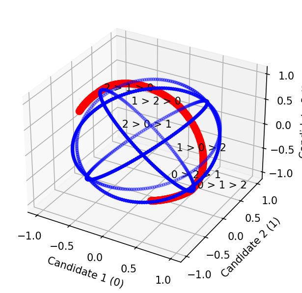 | 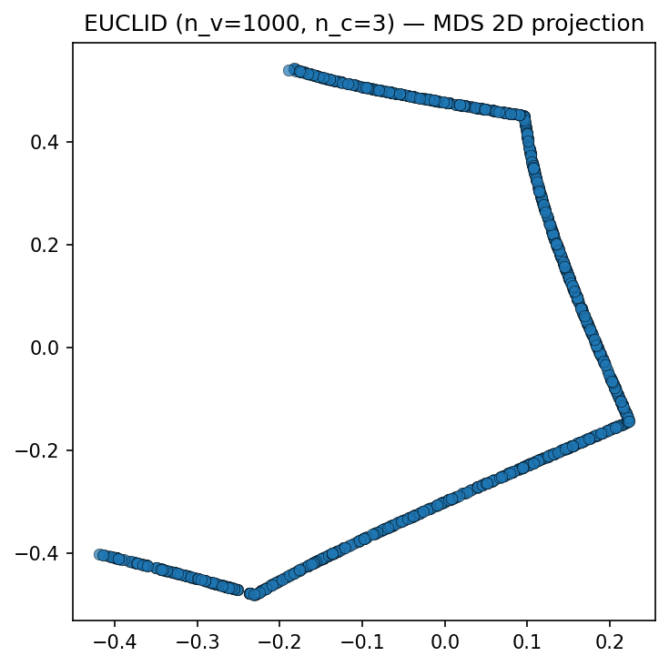 |
|||

## Gauss 

| 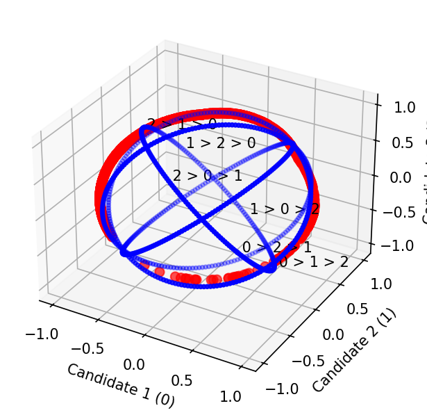 | 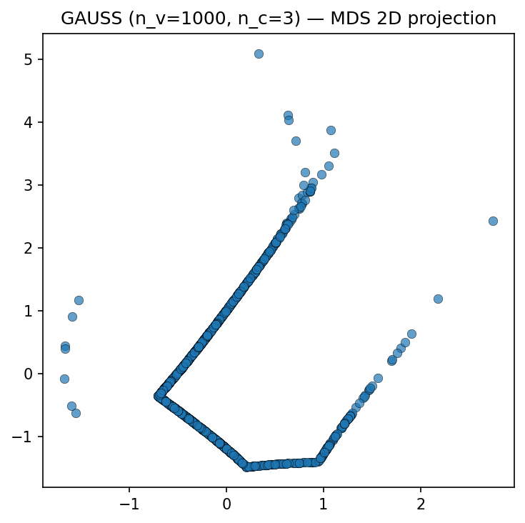 |
|||

## IANC 

Issue to fix not working for now

## IC 

|  | 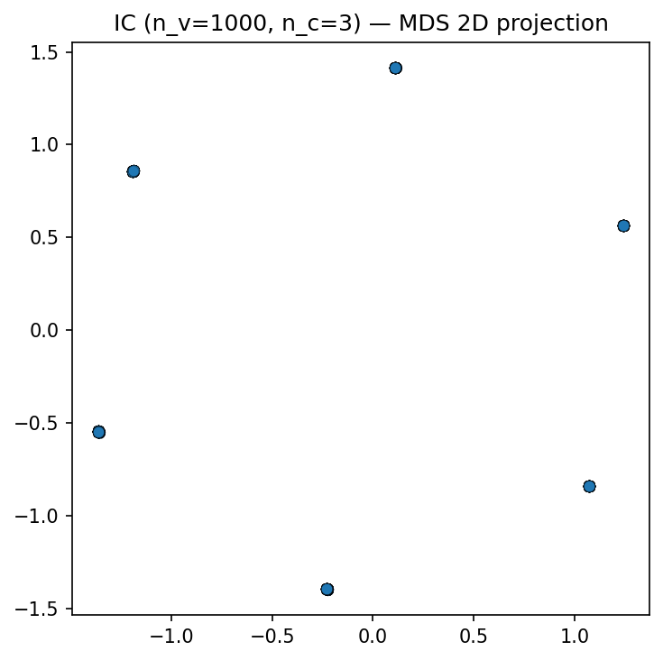 |
|||

## Ladder 

| 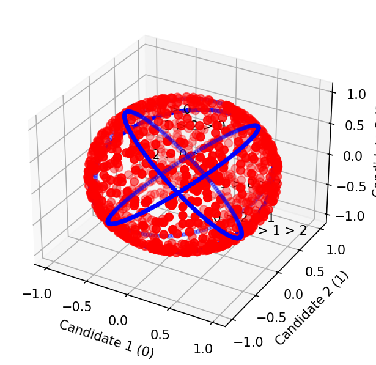 | 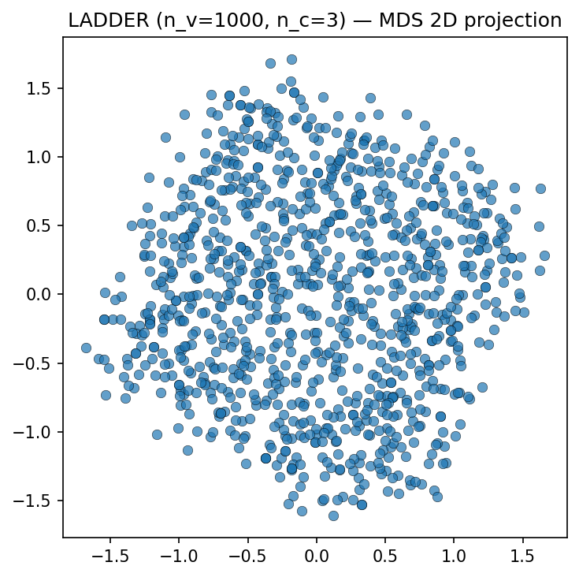 |
|||

## Perturb

| 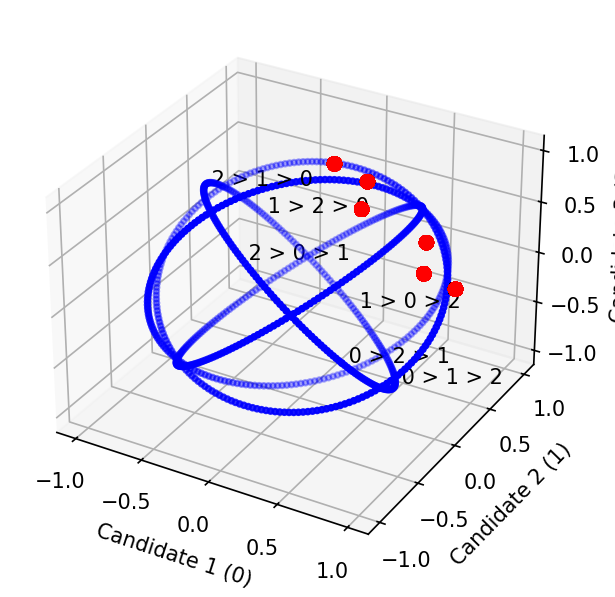 | 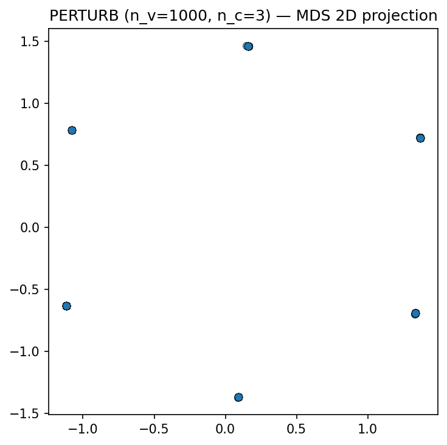 |
|||

## Spheroid 

| 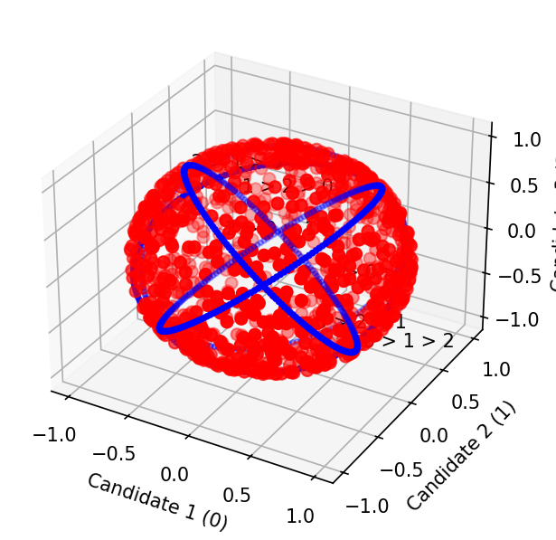 | 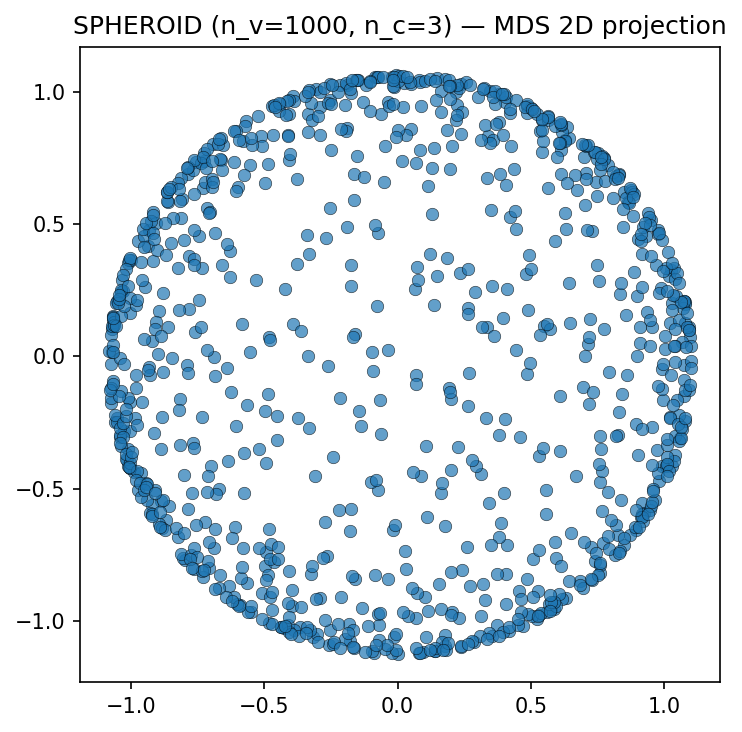 |
|||

## Uniform few ranking 

| 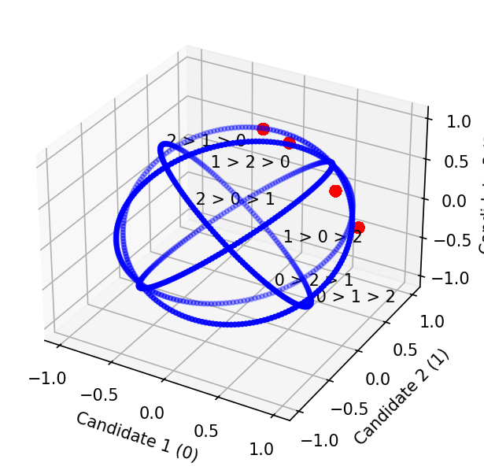 | 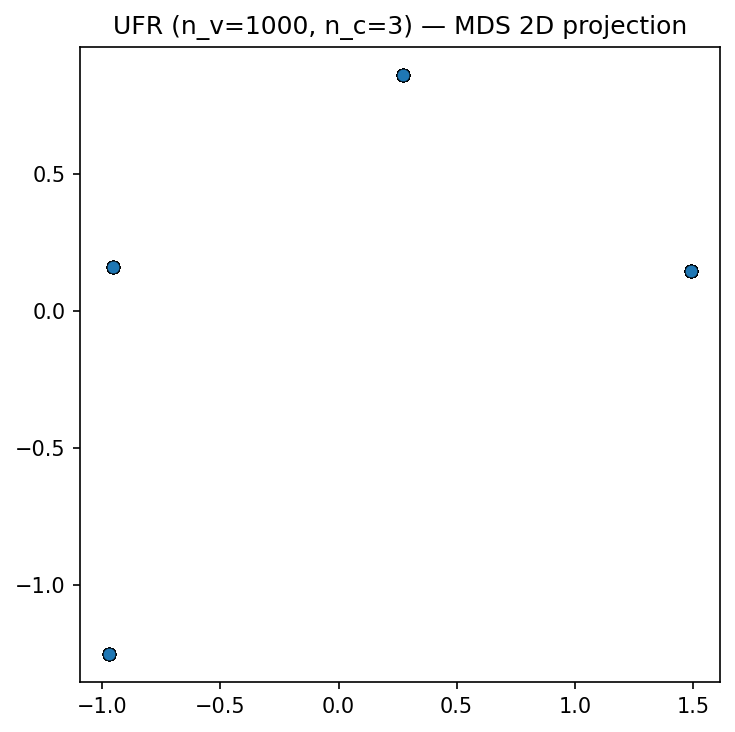 | 
|||

## Unanimous 

| 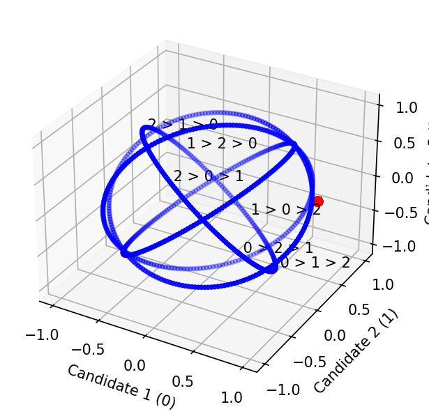 | 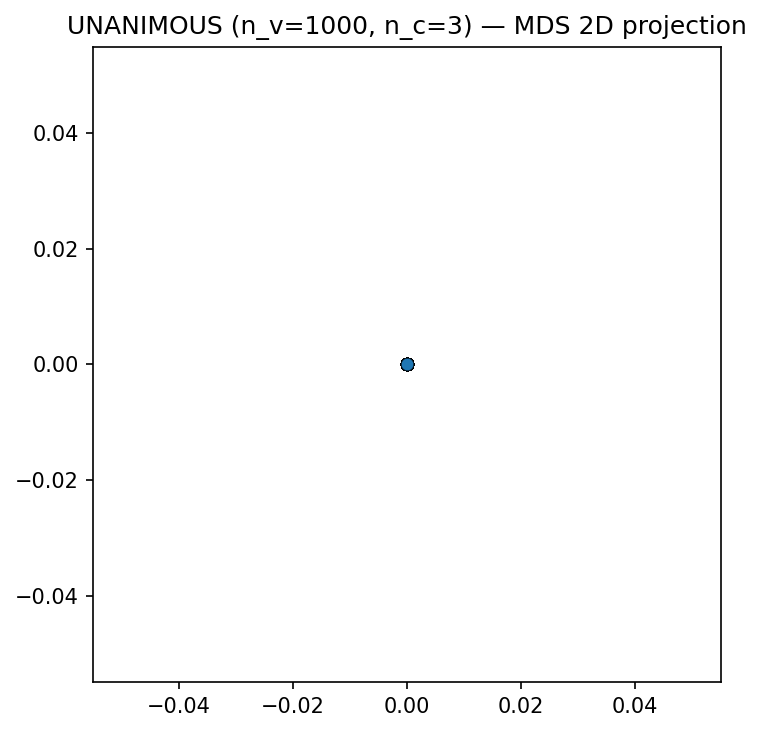 |
|||

## Uniform 

| 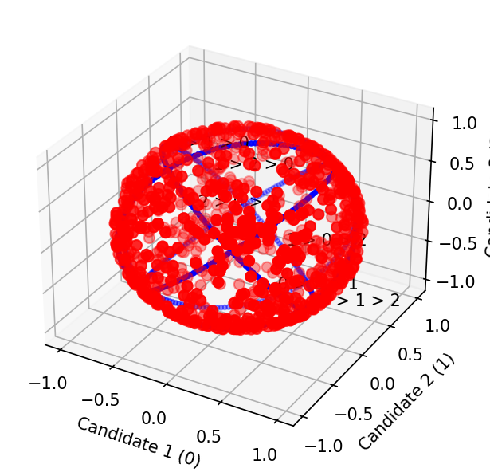 | 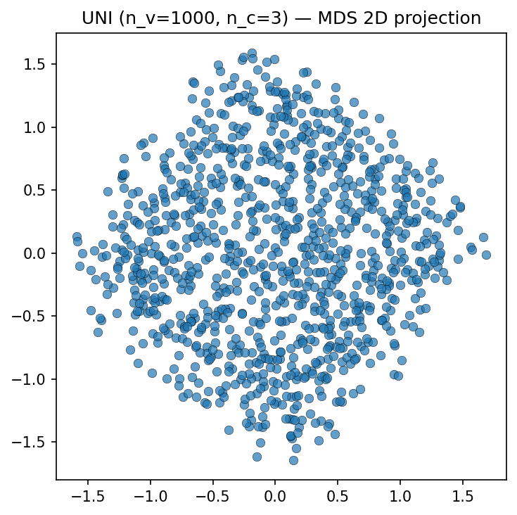 |
|||

## Von Mises-Fisher Hypercircle

| 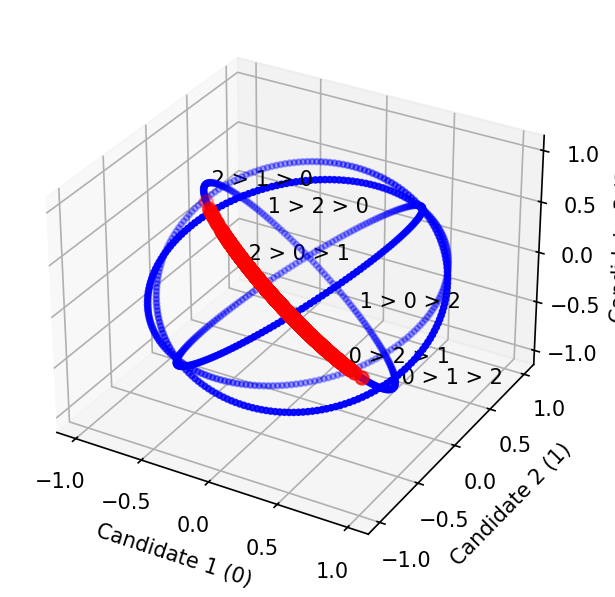 | 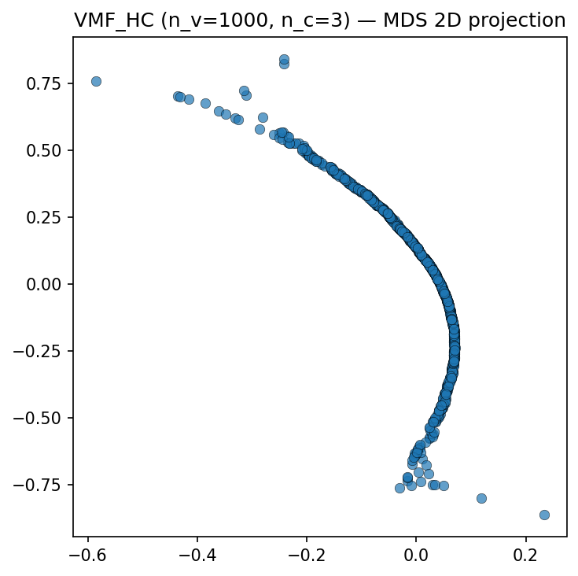 |
|||

## Von Mises-Fisher Hypersphere

| 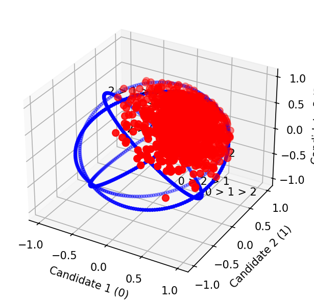 | 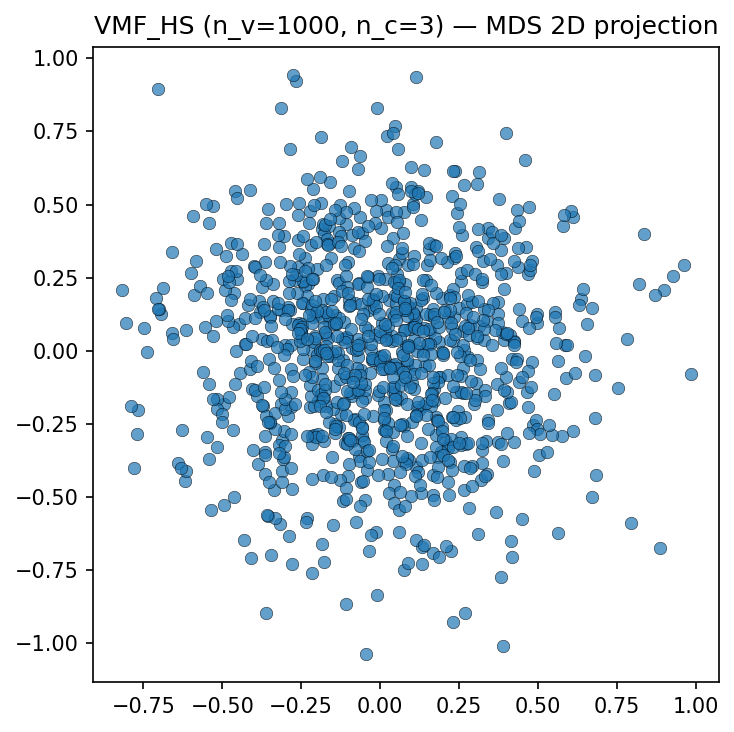 |
|||

// ::: vote_simulation.models.data_generation.generator_registry
